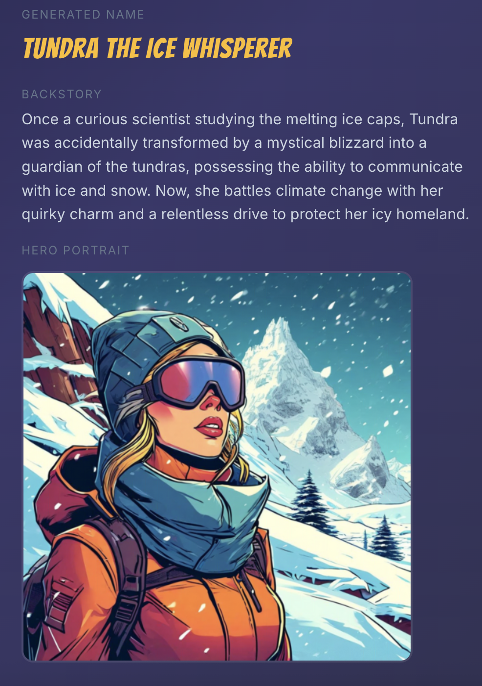

pw# Superhero Name Generator

<table>
<tr>
<td width="60%">

A full-stack web application that generates superhero names using two AI approaches side by side — a **Classic ML** model (TensorFlow LSTM on SageMaker) and a **Foundation Model** (Amazon Bedrock Nova Lite + Nova Canvas).

**[Live Demo](https://kd365.github.io/superhero-name-generator/)**

</td>
<td width="40%">

</td>
</tr>
</table>

The live demo is limited to 3 generations per visitor to manage AWS costs.

## Architecture

### Production (Deployed)

```
┌──────────────────────────────────────────────────┐
│  GitHub Pages — React Frontend                   │
│  Side-by-side: Classic ML vs Foundation Model    │
│  Rate Limiting (3 calls total, localStorage)     │
└──────────┬───────────────────────────────────────┘
           │ POST /api/generate  { seed, mode }
           ▼
┌──────────────────────────────────────────────────┐
│  API Gateway (us-east-1)                         │
│  REST API + CORS                                 │
└──────────┬───────────────────────────────────────┘
           │ Lambda Proxy
           ▼
┌──────────────────────────────────────────────────┐
│  AWS Lambda (Python 3.11)                        │
│  Routes by mode parameter:                       │
│                                                  │
│  mode="classic"     │  mode="bedrock"            │
│  ↓                  │  ↓                         │
│  SageMaker Runtime  │  Bedrock Runtime           │
│  invoke_endpoint()  │  converse() + invoke_model │
└──────┬──────────────┴──────┬─────────────────────┘
       ▼                     ▼
┌──────────────┐  ┌──────────────────────────────┐
│  SageMaker   │  │  Bedrock                     │
│  Serverless  │  │  Nova Lite → name + backstory│
│  Endpoint    │  │  Titan Image → hero portrait │
│  LSTM Model  │  └──────────────────────────────┘
└──────────────┘
```

## Technology Stack

| Layer | Technology |
|-------|-----------|
| **Frontend** | React 19, Vite |
| **Backend** | AWS Lambda (Python 3.11), API Gateway |
| **Classic ML** | TensorFlow LSTM on SageMaker Serverless |
| **Foundation Model** | Amazon Bedrock (Nova Lite, Titan Image Generator v2) |
| **Hosting** | GitHub Pages (frontend), AWS Lambda (backend) |
| **CI/CD** | GitHub Actions (build + deploy to Pages) |

## Features

- **Side-by-Side Comparison** — See Classic ML and Foundation Model results simultaneously
- **Classic ML Mode** — TensorFlow LSTM trained on 9,000+ superhero names generates character-by-character names via SageMaker
- **Foundation Model Mode** — Amazon Nova Lite creates unique names + backstories, Titan Image Generator produces hero portraits
- **Content Safety** — Sanitized prompts and retry logic to handle Titan's content filters
- **Rate Limiting** — 3 generations per visitor via localStorage to control AWS costs
- **Serverless Backend** — Lambda + API Gateway + SageMaker Serverless for zero idle cost

## How It Works

### Classic ML Mode
1. User enters a seed word (e.g., "star")
2. Lambda converts seed characters to indices using a 28-character vocabulary
3. Lambda iteratively calls the SageMaker endpoint (TF Serving)
4. Each iteration pads the sequence, gets the next character prediction via argmax
5. Generation stops when the model predicts the end token or after 33 characters
6. Returns the generated name (e.g., "Starlord")

### Foundation Model Mode
1. User enters a seed word
2. Lambda calls Bedrock Nova Lite via the Converse API to generate a name + backstory
3. Lambda sanitizes the hero name (removes terms that trigger content filters)
4. Lambda calls Bedrock Titan Image Generator v2 to create a hero portrait
5. If the image is blocked by content filters, retries with a generic safe prompt
6. Returns name, backstory, and base64-encoded portrait image

## Project Structure

```
superhero-name-generator/
├── src/
│   ├── App.jsx                  # Side-by-side UI with results cards
│   ├── main.jsx                 # React entry point
│   ├── index.css                # Dark theme styles
│   └── services/
│       └── apiService.js        # API client, rate limiting
├── lambda/
│   └── lambda_function.py       # Lambda handler (classic + bedrock modes)
├── sagemaker/
│   └── code/
│       └── inference.py         # SageMaker inference script (reference)
├── .github/workflows/
│   └── deploy.yml               # GitHub Pages deployment workflow
├── vite.config.js               # Vite configuration
├── package.json                 # Frontend dependencies
└── index.html                   # HTML entry point
```

## LSTM Model Details

The Classic ML model is a character-level LSTM originally trained via a Coursera guided project:

- **Architecture**: Embedding(29,8) → Conv1D(64) → MaxPool → LSTM(32) → Dense(29, softmax)
- **Parameters**: 16,229
- **Training Data**: 9,000+ superhero names, 88,279 character sequences
- **Vocabulary**: 28 lowercase characters + end token
- **Model Size**: 229KB (.keras), converted to SavedModel format for TF Serving

## Rate Limiting

The live demo limits each visitor to **3 total generations** (across both modes) to keep AWS costs minimal. The counter is stored in the browser's localStorage. This is a portfolio demonstration — the architecture supports unlimited usage in a production setting.

## API Endpoint

| Method | Endpoint | Description |
|--------|----------|-------------|
| POST | `/api/generate` | Generate name — accepts `{"seed": "...", "mode": "classic"|"bedrock"}` |

## Author

**Kathleen Hill**
- Portfolio: [khilldata.com](https://khilldata.com)
- GitHub: [@kd365](https://github.com/kd365)
- LinkedIn: [kathleen-hill322](https://www.linkedin.com/in/kathleen-hill322/)
